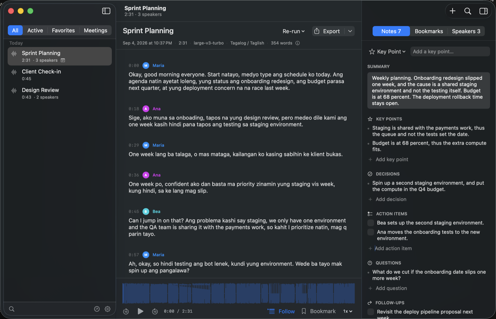
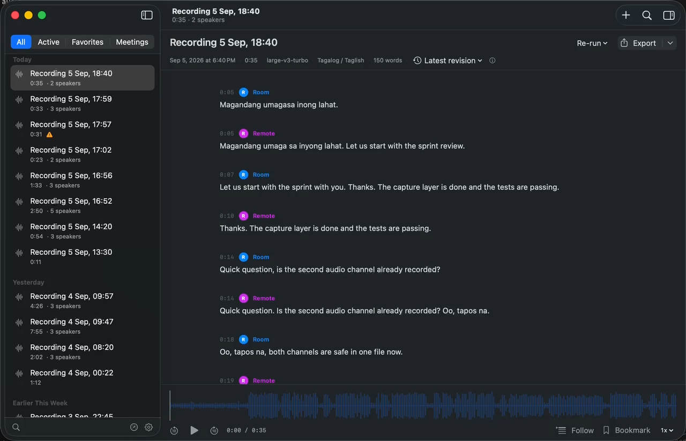
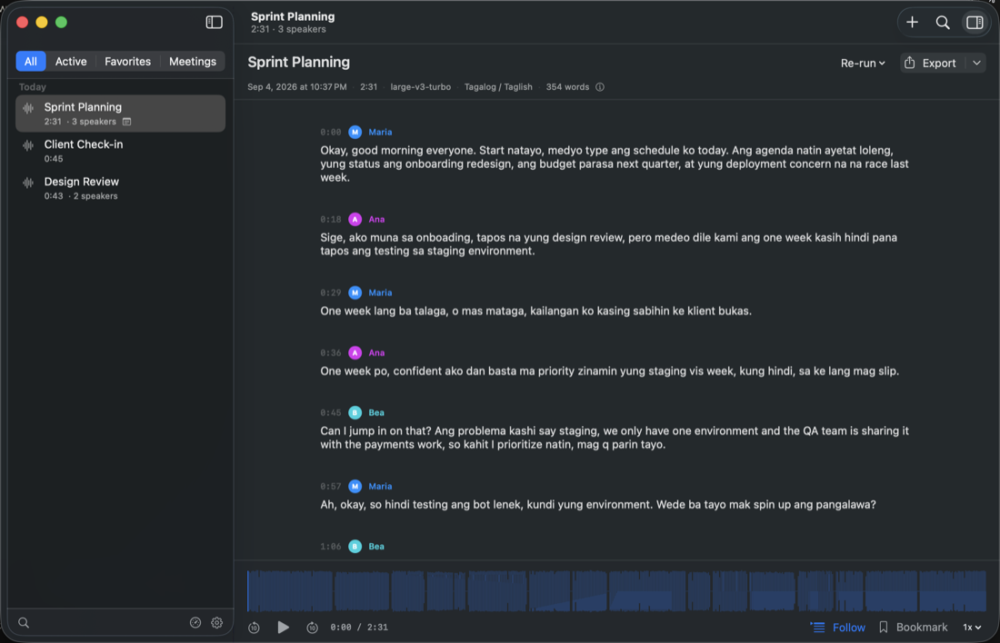
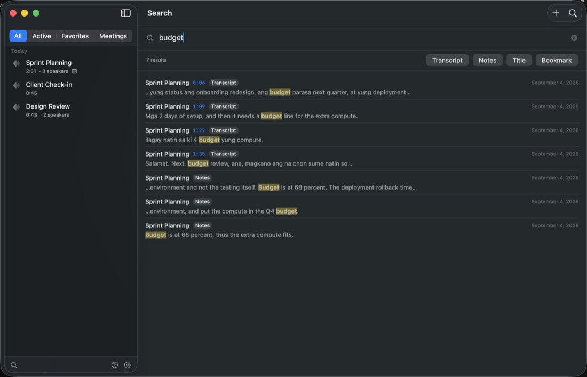
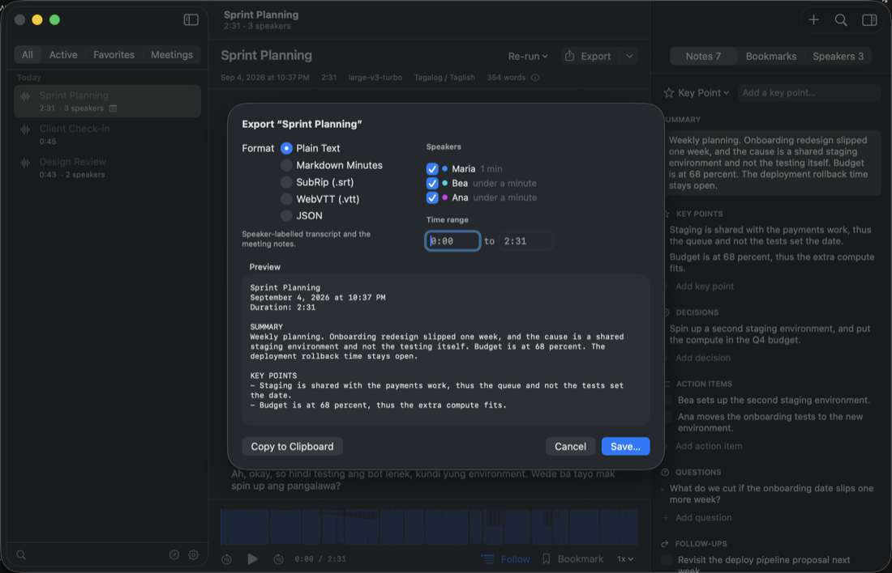
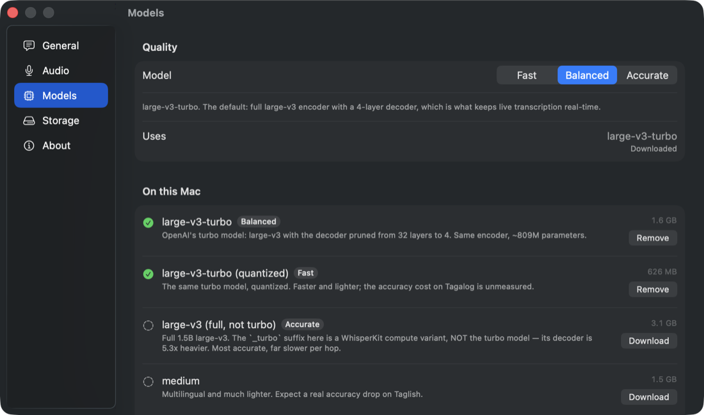

# Notero

A native macOS app that records a meeting, transcribes it on your Mac, and
keeps your notes with the transcript.

Notero runs every model on your own machine. It transcribes 15 languages and
can also detect the language for you. Tagalog and Taglish are the default,
because code-switched Filipino speech across a room is the case that this app
is tuned and measured against. There is no account, no API key and no server.
No recording, no transcript and no note goes off your Mac.



## Features

- Record from the microphone, or import an MP3, WAV, M4A, MP4 or MOV file.
- Live transcription while you record, and whole-file transcription after.
- 15 languages and automatic detection. Tagalog and Taglish are the default.
- Speaker identification, with manual merge and reassignment.
- Meeting notes: a summary and five lists, which are key points, decisions,
  action items, questions and follow-ups. Each item keeps the timestamp and the
  transcript line that it came from.
- Transcript editing, with revisions and one-step undo for each turn.
- Synchronized transcript and audio playback, with bookmarks.
- Full-text search across each transcript, note, action item and bookmark.
- Export to TXT, Markdown, SRT, VTT and JSON.
- A model benchmark that measures the three speed tiers on your own audio.

[docs/USAGE.md](docs/USAGE.md) explains each of these, and gives the keyboard
shortcuts.

## Demo

[](docs/images/demo.mp4)

[**Watch the demo**](docs/images/demo.mp4) — under two minutes, with sound.
Click the picture to play it.

The video shows one recording from the start to the transcript:

1. A recording starts. The meter shows the level of the audio.
2. A clip plays through the speakers. The system tap gets that clip directly,
   and the microphone gets the same sound across the room. One recording holds
   the two in different channels.
3. The recording stops. The app transcribes each channel independently, then
   puts the two transcripts in time order.
4. Each line shows if the person is in the room or on the call.

**The demo plays a synthetic clip, and it is not a real meeting.** The clip
comes from the macOS `say` command, the same as the screenshots below. Read the
note under the screenshots: those voices say Tagalog words incorrectly, thus
the transcript in the video has more errors than real speech gives. The sidebar
in the video shows the test recordings of the maintainer, with the automatic
names that the app gives.

## What It Looks Like

| | |
| --- | --- |
|  |  |
| **Speaker turns.** Every turn keeps its start time. Click the time to play from there. Move one turn to another speaker when the model gets it wrong. | **Search.** One field across every transcript, note, action item and bookmark. Filter the results by kind. |
|  |  |
| **Export.** Five formats. Pick the speakers and the time range, then save the file or copy it. | **Models.** Three speed tiers. Each one runs on the Neural Engine of your own Mac. |

**The screenshots use a demo library, and not a real meeting.** The audio is a
synthetic Taglish clip from the macOS `say` command. macOS has no Filipino
voice, thus the clip uses an Indonesian and a Malay voice for the Tagalog
turns. Those voices say Tagalog words incorrectly, therefore the transcript in
the screenshots has more errors than a recording of real speech gives.
[docs/BENCHMARKS.md](docs/BENCHMARKS.md) gives the measured accuracy and the
conditions of the measurement.
`app/scripts/make-demo-meetings.sh` builds the clip, and its comments explain
how to fill a demo library without a touch to your own recordings.

## Requirements

- **macOS 15 or later** to run the app.
- **A Mac with Apple silicon.** The models run on the Neural Engine.
- **Xcode 26 or later** to build the app.
- **Approximately 1.9 GB of free disk space** for the model weights.
- **A network connection** for the first build and the first start.

## Build

```bash
cd app && ./build-app.sh && open Notero.app
```

The app bundle is necessary. macOS gives microphone access only to a signed app
bundle. At the first start, the app downloads the model weights to
`~/Library/Application Support/Transcriber/Models`.

[docs/DEVELOPMENT.md](docs/DEVELOPMENT.md) gives the tests, the CI job and the
development workflow.

## How It Works

```
SwiftUI              the window, the library and the transcript view
  ↓
TranscriberStore     the SwiftData schema and the queries
  ↓
TranscriberCore      the commit policy, the merger, the exports and the search
  ↓
TranscriberEngine    the audio, the models and the job queue
  ├── WhisperKit     speech recognition
  └── FluidAudio     voice activity detection and speaker identification
```

There are four layers. Each layer builds and tests without the layer above it.
Three protocols hide the engines, thus you can replace a backend without a
change to the user interface.

[docs/ARCHITECTURE.md](docs/ARCHITECTURE.md) gives the design, the two
transcription pipelines and the algorithms.

## Performance

The maintainer measured these numbers on one Mac, on a 57-second synthetic
Taglish test clip, with the default Balanced model:

| Measurement | Result |
| --- | --- |
| Whole-file real-time factor (RTF) | 0.09 to 0.14, which is 7 to 11 times faster than real time |
| Word error rate (WER) | 20.3% to 25.8% |
| Peak memory | approximately 300 MB |

**Read these numbers with their conditions.** The test clip is synthetic, the
reference transcript is small, and the measurement Mac is faster than the 16 GB
M2 Pro that the memory target assumes. Your own recordings will give different
numbers. [docs/BENCHMARKS.md](docs/BENCHMARKS.md) gives the method, the
conditions and the limits of each measurement.

## Privacy

Speech recognition, voice activity detection and speaker identification all run
on your Mac through CoreML. The app has no account, no API key, no telemetry,
no analytics and no crash reports.

**The app makes one network request, and no other.** At the first start, it
gets the model weights from Hugging Face over HTTPS. After that the app works
with no network at all. It does not update itself, thus it asks no server
whether a newer version exists. To move to a newer version, get it from the
[releases page](https://github.com/jamesulip/notero/releases) yourself.

No request carries audio, a transcript or a note. Your recordings and your
notes stay in `~/Library/Application Support/Transcriber/`. The app adds no
encryption of its own, thus FileVault is the only protection.
[SECURITY.md](SECURITY.md) gives the full security position.

## Documentation

| Document | Contents |
| --- | --- |
| [docs/USAGE.md](docs/USAGE.md) | What each part of the app does, and the keyboard |
| [docs/ARCHITECTURE.md](docs/ARCHITECTURE.md) | The four layers, the pipelines and the algorithms |
| [docs/DEVELOPMENT.md](docs/DEVELOPMENT.md) | Build, tests, CI, scripts and the workflow |
| [docs/MODELS.md](docs/MODELS.md) | The three tiers, the model IDs and the naming trap |
| [docs/CLI.md](docs/CLI.md) | The `transcribe` command-line tool |
| [docs/BENCHMARKS.md](docs/BENCHMARKS.md) | RTF, WER and memory, with their conditions |
| [docs/FINDINGS.md](docs/FINDINGS.md) | Engineering findings and the failures behind the design |
| [docs/RELEASE.md](docs/RELEASE.md) | How to build and publish a release |
| [docs/LEGACY-SERVER.md](docs/LEGACY-SERVER.md) | The Python server, which the app replaced |

[CHANGELOG.md](CHANGELOG.md) lists what each version contains. Four files in
`docs/` keep the words that they had on the date at the top:
[FINDINGS.md](docs/FINDINGS.md), [PLAN.md](docs/PLAN.md),
[ENVIRONMENT.md](docs/ENVIRONMENT.md) and
[APP-UPDATE-PLAN.md](docs/APP-UPDATE-PLAN.md). The last three are design
history and not current documentation.

**Read [docs/FINDINGS.md](docs/FINDINGS.md) before you trust a number on this
page.** Eleven findings changed the design. In one of them, a single refused
decode window deleted 44% of a transcript and reported no error. In another,
the speaker model merged two different voices that shared a 10-second chunk.

## Status

Version 1.0.0 is the first public release. Every feature in the list above is
complete and tested. [CHANGELOG.md](CHANGELOG.md) gives what it contains, and
the private builds that came before it.

Version 1.0.0 does **not** contain a local LLM, automatic summaries, automatic
extraction of action items and decisions, topic detection, semantic search,
speaker voice profiles, or any cloud function. The data model already has the
shape that each of these functions needs, thus none of them needs a rebuild of
the app.

## Contributing

[CONTRIBUTING.md](CONTRIBUTING.md) gives the layer rules, the checks to run
before a pull request, and the changes that are usually refused. Report a
security problem privately through [SECURITY.md](SECURITY.md) and not in a
public issue.

**Do not attach a real meeting recording or a real transcript to an issue.**

## License

Notero is MIT licensed. [LICENSE](LICENSE) gives the terms.

The licence covers the code in this repository. It does not cover the model
weights. This repository contains no weights. The app downloads them at the
first start, and each one carries the licence of its own publisher. Read
[docs/MODELS.md](docs/MODELS.md) before you distribute a bundle that contains
these weights.
